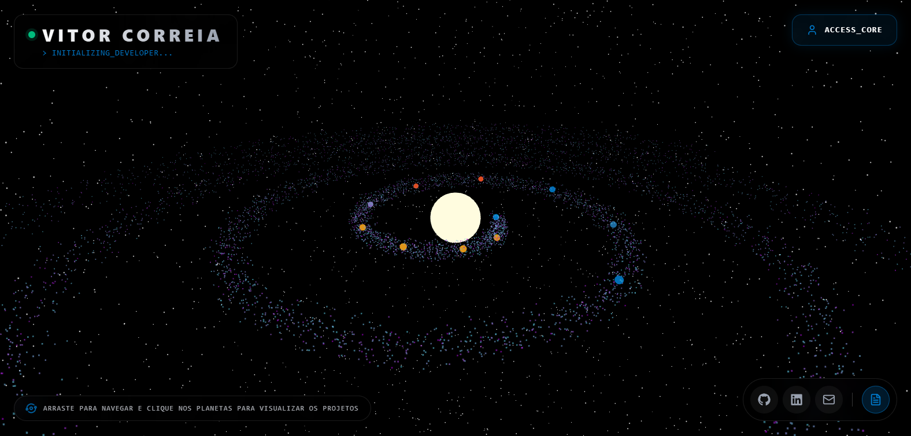

# Olá, eu sou o Vitor Correia 👋
### Desenvolvedor FullStack

---

Focado no ecossistema JavaScript/TypeScript (Next.js/Node) e APIs robustas em Java. Apaixonado por transformar desafios de engenharia em interfaces imersivas e experiências de usuário de alto nível.

> 🪐 **Destaque:** Explore meus projetos em um ecossistema 3D interativo!

  
  <i>Visite a galáxia ao vivo: <a href="https://vitorcorreia.vercel.app">vitorcorreia.vercel.app</a></i>

---

## 🚀 Projetos em Destaque (Engenharia & Solução)

Aqui estão os repositórios que demonstram minha capacidade técnica em resolver problemas reais:

### ☀️ Universe Portfolio 3D
* **Problema:** Portfólios tradicionais são estáticos e falham em engajar ou mostrar a complexidade técnica de renderização 3D.
* **Solução:** Desenvolvi um sistema solar onde repositórios do GitHub orbitam um Sol central. Consumo dinâmico da API do GitHub e renderização de documentação em HUD holográfico.
* **Stack Principal:** `Next.js (App Router)`, `React Three Fiber`, `Three.js`, `TypeScript`, `Tailwind CSS`.
* 🔗 [Ver Repositório](https://github.com/vitorcorreia20/portifolio-universe) | 🪐 [Explorar Galáxia](https://vitorcorreia.vercel.app)

### 🏦 Banco POO (Java)
* **Problema:** Necessidade de simular transações bancárias complexas garantindo a integridade dos dados e padrões de segurança básicos.
* **Solução:** Implementação completa de um sistema bancário usando os pilares da Programação Orientada a Objetos (Herança, Polimorfismo, Encapsulamento). Aplicação de Design Patterns para escalabilidade.
* **Stack Principal:** `Java`, `OOP`, `Clean Code`.
* 🔗 [Ver Repositório](https://github.com/vitorcorreia20/desafio-banco-poo)

### 🧬 Otimização com Algoritmos Genéticos (Python)
* **Problema:** Necessidade de encontrar soluções eficientes para problemas complexos de otimização onde abordagens de força bruta são inviáveis computacionalmente.
* **Solução:** Desenvolvimento de algoritmos genéticos baseados em pesquisa acadêmica para simular seleção natural (mutação, crossover) na otimização de variáveis matemáticas.
* **Stack Principal:** `Python`, `Numpy`, `Time`.
* 🔗 [Ver Repositório](https://github.com/vitorcorreia20/-Projeto-AG---Primeira-Avaliacao)

---

## 🛠️ Tecnologias e Hierarquia Técnica

  <strong>Stack Principal (Foco Atual):</strong> 
  

  <strong>Outras Ferramentas & Conhecimentos:</strong> 
  

---

## 💼 Liderança & Comunidade (Soft Skills em Ação)

* **Organizador do Hacktoberfest 2025 PHB Edition** 🎃
* **Organizador da Semana da Computação (SeCom)** - UESPI 💻
* **Finalista do I Ideathon UFDPar** 🏆

---

## 🏆 Atividade no GitHub

  
  

---

## 📫 Vamos conversar?

  
  

